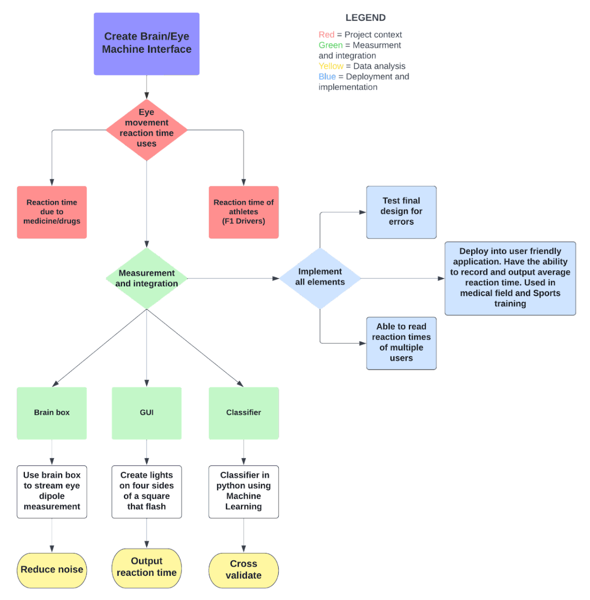
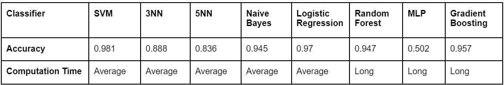
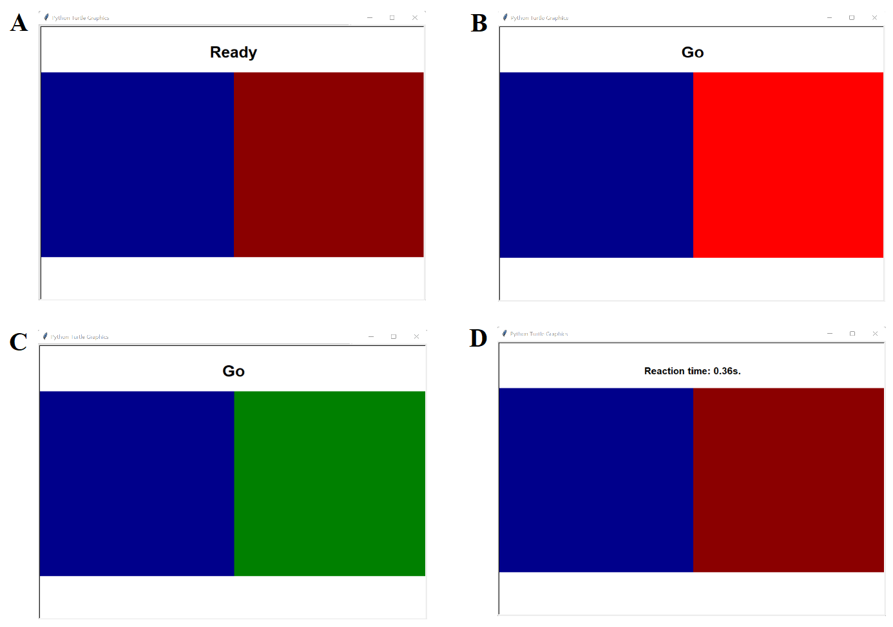

<style type="text/css">

body{ /* Normal  */
      font-size: 14px;
      text-align: justify;
  }
h1, h2 { /* add border to h1 and h2 */
  border-bottom: solid 1px #666;
}
h1 { /* Header 1 */
  font-size: 56px;
  color: Black;
}
h2 { /* Header 2 */
    font-size: 18px;
  color: Black;
}
h3 { /* Header 3 */
  font-size: 16px;
  color: Grey;
}
</style>
```{r setup, include=FALSE} 
knitr::opts_chunk$set(echo = TRUE, warning = FALSE, message = FALSE) 

library(reticulate)
library(tidyverse)
```

# **1 Executive Summary**

## **1.1 Aim and Background**

Ocular reaction time is an important factor in many aspects of everyday life and the ability to record this can be applied in many situations. Not only can professional athletes focus on improving this to gain an advantage over their competitors, it can also be used as an indicator of illness and disease. The aim of our project was to create an application which measured the ocular reaction time of the user. To address this a multidisciplinary approach was required where physicists provided knowledge on the operation and functionality of equipment, while data scientists contributed expertise in software design and modelling.

<br/>

#### **Target audience**
The main application of this product would be directed to areas such as research, road safety, high performance sports and rehabilitation. Researchers can utilise eye reaction time to investigate the effects of external factors such as drugs and fatigue on perception. Transport departments can utilise the product to determine whether an individual has the ability to react to road dangers to be able to obtain a licence. High performance sports such as F1, can train reaction speeds of athletes by implementing this product into routine training. Rehabilitation for various neurological problems could utilise the product to improve treatment engagement and self-efficacy.

## **1.2 Main Findings**
Our final product is an application which measures simple visual reaction time. We used a brain Spikerbox to record electrooculography signals and python to process this signal to identify an eye movement. The application uses amplitude and zero crossings to identify an eye movement event and uses a SVM model to classify it. Using a display, a left or right tile is flashed as a visual stimulus and the time taken for the subject to react in the correct direction is recorded. The program repeats this for 5 iterations and then the average reaction time is returned. 

## **1.3 Project Overview**



## **1.4 Practical Relevance of the Analysis** 

This product can be used...

# **2 Methods** 

## **2.1 Data Collection**

Due to the difference in charge between the cornea and the retina of the eye, a dipole is induced which can be measured using EOG signal. We positioned electrodes above the right eye and measured EOG signals for different participants multiple times to gather training data for our classifier. The data was filtered using a Notch filter and a Low Pass filter. Each data recording was 30 seconds and an event was performed every 2 seconds. Data was collected for 5 eye movements, left, right, up, down and blink. 

## **2.2 Developed Model**

#### **Physics Perspective:**

The final model for collecting data involved many aspects to record and live stream accurate data. These included aspects such as electrode placement, noise reduction and diverse input data. 

Electrode placement is crucial as it determines the strength of the dipole signal that is being recorded. Because of this, two electrodes were spaced out above one eye. Electrode gel was applied to make sure there was good contact between the electrode and skin.

Noise reduction was a major aspect of the final model. There many steps taken to reduce the overall noise that was present in the recorded data. The first step involved using separate electrodes instead of electrodes placed on a headband. This allowed for better placement of electrodes and the removal of any static interferences caused by the headband. New batteries were used during recording sessions as it allowed for the reduction of background noise. Filters were utilised to remove any further background noise and produce a cleaner recording of data. Double filtering was applied using a notch filter and a low pass filter. By manually counting the oscillations of the recorded data over three 0.1 second samples, the frequency that was decided to be filtered was 500 Hz. This implementation had drastically improved the signal quality from the EOG readings. 

Recording multiple data sets from multiple participants is vital in creating an accurate classifier. Recordings from all individuals of the group provided a large variety of data sets. Each individual's left/right eye movements, no eye movement and random eye movements were recorded.   

<br/>

#### **Data Science Perspective:**

**Extracting Events as Features:**  
Upon inspection of the recorded training data, we found that the EOG signals varied greatly between team members. Variations included baseline values and length and peaks/troughs of eye movement events. 

In order to extract the 10 eye-movements from each 30-second file for building our classifier,  there needed to be a mechanism to detect events despite all the variation. Given that each file will have different heights for the spikes, values as the origin and length of event, using only one test statistic was not always accurate. Thus, the team decided to use a combination of both amplitude and zero-crossings as thresholds for an event. The length of an event was manually decided to contain a good compromise between encompassing all event lengths and removing unwanted data. (see Figure 2).  It was found that this innovation drastically improved the accuracy of event detection. To implement zero-crossings, the median of each file had to be subtracted due to variations in baseline. We had to extend this to our final product, in which we added a calibration phase. 

Our final extraction code utilised a moving window of 2000 values, where the start of an event is indicated by zero crossings that's less than 10 and amplitude greater than or equal to 40. If the start of an event is detected, the code returns the window plus 13,000 values, for a total event size of 15,000 values. 

```{r Classifier}
#Function for extracting events
Classifer <- function(wave_file,
                      window_size_test = 2000, 
                      window_size_return = 15000,
                      increment = 100, 
                      threshold = 80) {
  
  wave_seq = wave_file
  testStat_zero = 0
  testStat_amp = 0
  Linterval = c()
  Uinterval = c()
  lower_interval = 1
  max_time = length(wave_seq)
  
  #Streaming Code
  while(max_time > lower_interval + window_size_test)
  {
    #look at window size of 2000 values
    upper_interval = lower_interval + window_size_test
    interval = wave_seq[lower_interval:upper_interval]
    
    #Calculate zero-crossings of window
    testStat_zero <- sum(interval[1:(length(interval) - 1)] *
                     interval[2:(length(interval))] <= 0) 
    
    #Calculate amplitude of window
    testStat_amp <- max(interval) - min(interval)
    
    if (testStat_amp >= 40 & testStat_zero < 10) {
      #If thresholds met, return 15000 values
      upper_return = lower_interval + window_size_return
      Linterval = append(Linterval,lower_interval)
      Uinterval = append(Uinterval,upper_return)
      lower_interval = lower_interval+ window_size_return +2000
    }
    else {
      lower_interval = lower_interval + increment
    }
    
  }
  #Return dataframe of lower and upper boundaries of events 
  return(data.frame(Lower_interval = Linterval,
                    Upper_interval = Uinterval)
         )
}
```

```{r}
left1 = read.csv("leftNEW3.txt", header = FALSE, sep = ",")
left_list1 <- split(left1, seq(nrow(left1)))
left_list1 <- unname(unlist(left_list1))

set = left_list1 - median(left_list1)

events = Classifer(set)

ggplot() +
  geom_line(aes(y = set, x = c(1:length(set)))) +
  geom_rect(aes(xmin=events$Lower_interval,
                xmax=events$Upper_interval, ymin=-Inf,
                ymax=Inf),
            fill = "green", alpha = 0.2)
```


**Feature Selection:**  
Since events varied so much between files, hard-coding thresholds for event classification was deemed impractical and hence machine learning was chosen. The team started by first sending the whole file into the classifier for it to train on where each y-value is considered a feature. However, there were way too many attributes in each row and there was way too much noise that the accuracy was very low regardless of what machine learning algorithm was used.

The team’s next idea was to use the properties of an extracted event as the variables for the classifier to train on. This includes the max y-value, the min y-value, the index of the max y-value, the index of the min y-value and standard deviation. However, it was found this method reduced a lot of information from the wave which caused underfitting.

Ultimately, the team decided to use all the values of an extracted event and use the y-values as features for the model to train on. 


**Classifiers:**  
Under supervised learning model, we implemented K-Nearest Neighbours (KNN), Naive Bayes, Logistic Regression, Random Forest, Support vector Machine (SVM), Multilayer Perceptron (MLP) and Gradient Boosting. 

The 15,000 values for an event was inputted into the AI model to predict the eye movement direction. Using the collected data, our team trained multiple AI models and tested the accuracy through repeated cross-validation. Initially, accuracy was at 50-60% range which was simply due to up and down movements being indistinguishable from each other. Our team decided to only train the models for left and right eye movement which improved accuracy to the 80-90% range. The SVM model had the highest accuracy of 98% hence our team selected this model to use in our application to identify the direction of the eye movement.  

**Selected Model:**  
Our final model was an SVM classifier which trained on the y-values of whole eye-movement events which were detected by zero-crossings and amplitude.

## **2.3 Evaluation Strategies** 

#### **Physics Perspective:**

**Recording Performance metrics**  
Utilising separate electrodes instead of a headband allowed for the reduction of overall noise. The variance of noise using the headband was around 20 mV from equilibrium. The use of electrodes reduced the variance down to 5-10 mV. Higher intensities of left and right movement were achieved due to the ability to alter the position of the separate electrodes. Electrode polarity also impacted the output signal of an eye movement. Opposite positions of the electrodes resulted in the troughs and peaks of the eye movement signal to be flipped. Because of this, electrodes were placed in a set configuration during all recording and live streaming sessions. 

Data filtration methods such as the low pass and notch filter allowed for reduction of specific frequency noise. As mentioned before, the selected frequency to be removed was 500 Hz. This chosen frequency provided more accurate measurements of signals from the SpikerBox due to the removal of unwanted frequencies. (See Appendix Figure 2) 

Operating conditions for data collection were always consistent. Steps involved included using a new battery for every recording session, using electrode gel, consistent timing of training data and varied user recordings.    
<br/>

#### **Data Science Perspective:**

**In-Sample Performance:**  
The team’s initial approach was to measure in-sample performance through a confusion matrix which will provide a variety of evaluation metrics such as accuracy, precision, sensitivity and F1-score. The accuracy measures how often the SVM classifier correctly predicts the eye-movements as left or right. Precision measures how many of the correctly classified eye-movements actually turned out to be a left eye-movement. Furthermore, sensitivity explains how many of the actual left eye-movements were predicted correctly. Precision and sensitivity can help with seeing the differences between left and right eye-movement signals, to evaluate which eye-movement was easier for the machine to classify. The F1 score is a more balanced and more robust mean which combines both precision and recall into a single measure, capturing both properties. 

```{python, results = 'hide', cache = TRUE, fig.cap = "Hello"}
import pandas as pd
from sklearn import svm
import matplotlib.pyplot as plt
from sklearn.model_selection import train_test_split
from sklearn.metrics import plot_confusion_matrix
import warnings
warnings.filterwarnings("ignore")


df = pd.read_csv('Events_final.csv')
column_names = list(df.columns)

# Extract Features
input_names = column_names[0:len(column_names)-1] 
X = df[input_names]   

# Extract Class
target_name = column_names[len(column_names)-1] 
y = df[target_name] 

# Train-test split
X_train, X_test, y_train, y_test = train_test_split(X, y, test_size = 0.33, random_state = 123) 
 
# Build model and predict
model = svm.SVC().fit(X_train, y_train) 
predictions = model.predict(X_test) 
 
# Plot Confusion Matrix
plot_confusion_matrix(model, X_test, y_test, colorbar = False)
plt.title("Confusion Matrix")
plt.show()
```

* **Accuracy** = 0.97  
* **Balanced Accuracy** = 0.975  
* **Precision ** = 1  
* **F1 Score ** = 0.97  

**Receiver Operating Characteristic (ROC) Curve:**  
The team also decided to use a probability curve, the ROC curve, which shows the trade-off between the true positive rate and false positive rate for a predictive model using different probability thresholds, separating the signals from the noise. This is a graphical means for determining the performance of the classifier. The higher the curve is above the random classifier dotted line, the better the performance of the classifier. Furthermore, the Area Under the ROC curve (AUC) is a complementary evaluation metric which measures the ability of the classifier to distinguish between classes. The higher the AUC value, the better the model is at distinguishing between left and right eye-movements.

**Out-of-Sample Performance:**  
Although in-sample performance was performed, these evaluation metrics are not protected against over-fitting. In order to evaluate the performance of the classifier when it predicts observations that were not used to build the model, the team used 5-fold cross-validation which will split the samples into folds and use different folds as train and test sets during each iteration. This way, all the data will be fully used both in training and in testing.

This was further improved by repeating this 50 times. The method repeats the cross-validation multiple times and returns the mean result across all folds from all runs, providing a more robust measure of performance.

**Comparison of Classifiers:**  
In comparison with the other classifiers, it was found that the SVM classifier not only had the highest accuracy of 98% but it also had a relatively fast training time. Therefore, the SVM algorithm was used to build the model.



**Stability**  
LOL

# **3 Results** 

## **3.1 Approach**
In consideration of multiple evaluation strategies, the approach has been refined to be an application that measures eye-movement reaction time based on a person’s response to flashing tiles. Even though there were multiple ways to achieve this, the team’s approach has been selected to maximise the usefulness, the performance and the reproducibility of the approach with consideration of the limited resources that were provided. 

From a physics perspective, the data collection was performed with electrode stickers rather than a headband since it was shown to give more observable spikes and reduced noise.

From the data science perspective, machine learning was used instead of hard-coding the thresholds to improve reproducibility since it accounts for the variations and the differences in the wave. For building the model, the combination of accuracy, precision, sensitivity, computation time and stability led to the decision that the SVM algorithm was the most accurate and most efficient classifier when it was trained on extracted events.

## **3.1 Tools**
The tools used to build the GUI were Python and Replit. Replit is a collaboration platform where team members could edit the code and provide feedback. Python was used because the GUI was inspired from the turtle package and the “Simon Says” game, thus Python had packages which were helpful for app development and interface modification.

Event detection and classification were originally performed in R studio. However, the team determined that it will be more cohesive to have the classification integrated into the program. Thus, the classification code was also translated into Python.

The tools used to perform machine learning were Python and Jupyter notebook. The variety of packages from sklearn made training the model and evaluating performance intuitive and efficient.

## **3.3 Innovation**
The team implemented numerous innovations in our approach to the scientific problem. For filtering the signals, the team used double filters to better reduce noise. For live streaming, the team implemented a calibration phase to take into account the variations in the signals when different people use the SpikerBox. This consequently also improves generalisability of the approach. For event extraction, the team found that the use of only metric was not able to capture the variations in signals when different people used the program. Sometimes, the amplitude of the spike can be either really high or really low. Thus, the team combined both amplitude and zero-crossings for more accurate event detection. For classification, the team also used machine learning rather than hard-coding thresholds to also take into account individual variations for generalisability. The biggest innovation was the GUI itself, which contained interactive text and animated flashlights.

## **3.4 Deployment Process**
The deployment process involves bringing all components of the project into the GUI. The first stage was to use the SpikerBox to record training data. Then event extraction was performed through R studio and the values saved to a csv file. The csv file is then read into Jupyter Notebook where sklearn builds the SVM model. The SVM model is saved and uploaded to the GUI.

During the live streaming phase, the program starts with a calibration phase of 10 seconds to find the baseline of the subject. The application starts, showing two tiles and one will eventually flash. The user will perform an eye-movement corresponding to the light that flashed. The GUI detects that eye-movement and the SVM model will classify the eye-movement as either left and right. Once the eye-movement is determined to be correct, the application will return the reaction time. If the eye-movement was incorrect, the user will get another attempt at responding to the light. The program will run for 5 iterations and return the average reaction time. (See Figure 4)

The final stage is live testing and the measuring of the performance of the program. The program was tested by multiple students, including students of different genders and different ethnicities. The data was recorded and summaries were produced, including how often the program worked, the average reaction time, the accuracy of the classification.



## **3.5 Data Summaries** 
Our team conducted guerrilla testing to test the usability of the product (See Appendix 1). From the feedback, we improved the product GUI to make it more user-friendly and improved the condition of the data collection materials. Figure 5 below shows the results of the testing.

**Key Findings:**  
It was found that the program was working consistently and was running to completion. However, the accuracy during live testing was lower than the accuracy of 98% that was produced from cross-validation for the SVM model, This likely occurred due to the fact that many of the live testing signals were different from what the SVM model was trained on, that is the raw data that the team recorded. It was also found that the eye detection process was not as smooth and fluid as anticipated. The program will appear to lag or have a delay when a person looks in a particular direction. Sometimes, the person will have to look aggressively, or even move their eyes multiple times for their eye-movement to be detected. This is likely due to the limitations in the team’s approach to event detection. The detector might have interpreted some eye-movements as noise if it was below the event threshold. 

**Robustness and Generalisability of Findings:**  
The findings were limited to the few students that were able to live streaming the program. This means that the findings did not take into account users of different age, health condition or mental capability. More varied samples will be needed to increase the robustness and generalisability of the findings.

**Robustness and Generalisability of the Product:**  
The use of calibration and machine learning to take into account individual variations has increased the generalisability of the product. However, the SVM model was not trained on many edge cases such as small eye-movements which might reduce the robustness of the product. The program could be improved by generalising event detection with an additional calibration instead of using thresholds and more data could be recorded to ensure the robustness of the classifier.

# **4 Discussion**

## **4.1 Limitations** 

During the development process, our team encountered issues with live-streaming Spikerbox data due to sensitivity to noise and attributes on the participant such as hair. The placement of the electrodes, Spikerbox batteries and electrical leads also seem to skew the quality of the data. The low pass filter threshold may have also affected the input data for the classifier. This input data is used to detect and classify eye movement and the result is used by the GUI for its rendering. All of these processes and computation times affect the accuracy of the reaction time. 

Our team found the product may have issues classifying eye movement on different participants during the testing phase. Since the SVM model was trained with 105 samples, the amount of training data might be too small and hence does not generalise well, likely due to over-fitting. The current product is limited to measuring simple visual reaction time with only one stimulus and hence will restrict the target market and applicability. The application returns the average reaction time hence the iterations of incorrect movement will add zeros and the mean will skew to 0. This will then return quick average reaction times to individuals who mostly look in the incorrect direction. 

## **4.2 Future Work** 

The SVM model could be improved by gathering a lot training data. The application failed to identify events of some eye movements hence the low pass filter threshold can be reduced to around 10Hz to prevent this. Our application currently can only classify left and right eye movement. However, in future development it could be expanded to up-down eye movement and muscle signals. This would enable our application to measure complex/choice reaction time which involves response to numerous stimuli and extend target market. The application can also be extended for use in mobile/tablet devices, virtual reality (VR)  and augmented reality (AR) to increase the accessibility. 

The final product can be improvised as a mobile application which can be used for medical purposes where doctors can review their patients performance and detect any issues. 

# **5 Conclusion**

# **6 Student Contributions**

# **7 References** 

# **8 Appendix**

```{python}
import pandas as pd
from sklearn import svm
import matplotlib.pyplot as plt
from sklearn.model_selection import train_test_split
from sklearn.metrics import plot_confusion_matrix
import warnings
warnings.filterwarnings("ignore")


df = pd.read_csv('Events_final.csv')
column_names = list(df.columns)

# Extract Features
input_names = column_names[0:len(column_names)-1] 
X = df[input_names]   

# Extract Class
target_name = column_names[len(column_names)-1] 
y = df[target_name] 

# Train-test split
X_train, X_test, y_train, y_test = train_test_split(X, y, test_size = 0.33, random_state = 123) 
 
# Change {"L", "R"} to {1, 0}
lb = preprocessing.LabelBinarizer()
y_test = lb.fit_transform(y_test)

# Build the model
clf_svm = svm.SVC(probability = True).fit(X_train, y_train)

# Prediction probability
y_score = clf_svm.predict_proba(X_test)[:,1]

# False positive rate and true positive rate using different probability thresholds
false_positive_rate, true_positive_rate, threshold = roc_curve(y_test, y_score)

print("roc_auc_score for SVM: {:.4f}".format(roc_auc_score(y_test, y_score)))

# Plot the ROC curve
plt.title("ROC Curve - SVM")
plt.plot(false_positive_rate, true_positive_rate)
plt.plot([0, 1], ls="--") # Dotted line
plt.plot([0, 0], [1, 0] , c=".7"), plt.plot([1, 1] , c=".7")
plt.ylabel('True Positive Rate')
plt.xlabel('False Positive Rate')
plt.show()

```


