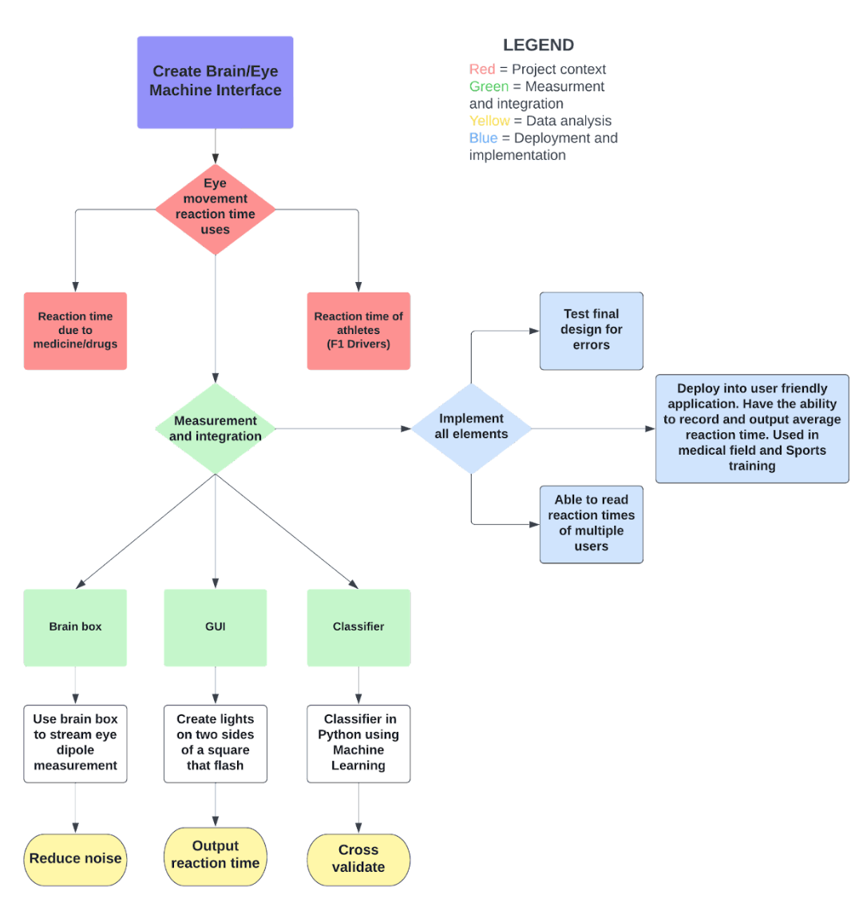

<style type="text/css">

body{ /* Normal  */
      font-size: 14px;
  }
h1, h2 { /* add border to h1 and h2 */
  border-bottom: solid 1px #666;
}
h1 { /* Header 1 */
  font-size: 56px;
  color: Black;
}
h2 { /* Header 2 */
    font-size: 18px;
  color: Black;
}
h3 { /* Header 3 */
  font-size: 16px;
  color: Grey;
}
</style>
```{r setup, include=FALSE} 
knitr::opts_chunk$set(echo = TRUE, warning = FALSE, message = FALSE) 

library(reticulate)
library(tidyverse)
```

# **1 Executive Summary**

## **1.1 Aim and Background**
The aim of our project was to create an application which measured the ocular reaction time of the user. Having an accurate and precise measurement of an individual’s ocular reaction time is difficult to obtain because most methods require the movement of a different part of the body to indicate response to stimulus. Professional athletes for example need to know their reaction time if they wish to improve it and gain an advantage over their competitors. However, everyone’s reaction time is important as it can be an indicator of illness and disease. Especially when it is varied significantly based on the location of the stimulus. To solve this problem a multidisciplinary approach was required. Physicists provided knowledge on the operation and functionality of equipment for clean data extraction of user’s eye movements. Data scientists contributed expertise in software design and modelling, taking the extracted data and giving cause to its value.

## **1.2 Main Findings**
We found that we could produce an application which measures simple visual reaction time. We used a brain Spikerbox^1^ to record electrooculography signals and python to process this signal to identify an eye movement. The application uses amplitude and zero crossings to identify an eye movement event and uses a SVM model to classify it. Using a display, a left or right tile is flashed as a visual stimulus and the time taken for the subject to react in the correct direction is recorded. Although the model was theoretically highly accurate and stable, it was found that the product was still susceptible to slight variations with the SpikerBox and the electrode placements and it is important to take them into account for better generalisability in the future.

## **1.3 Project Overview**

```{r Figure 1, fig.align="left", fig.cap="**Figure 1 Project Overview.** Visualises steps taken to produce final product"}

```

## **1.4 Practical relevance of the Analysis**

Our product can be applied in industries including medical research, road safety, high performance sports and cognitive rehabilitation. Researchers can utilise eye reaction time to investigate the effects of external factors such as drugs and fatigue on perception. Transport departments can utilise the product to determine whether an individual has the ability to react to road dangers to be able to obtain a licence. High performance sports such as F1, can train reaction speeds of athletes by implementing this product into routine training. Rehabilitation for various neurological conditions could utilise the product to improve treatment engagement and self-efficacy^2^.

# **2 Methods** 

## **2.1 Data Collection**

Three electrodes were placed on the user to measure electrical signals generated by the body (the dipole created between the cornea and retina). Two were placed on the subject’s forehead above their eyebrow, and one was placed behind their ear on the mastoid. Electrode gel was applied between each electrode and the skin. The positive and negative terminals were attached on the forehead and the ground terminal was attached to the mastoid. Data output from the SpikerBox was live-streamed to a computer, where it was processed in Python using a notch filter, removing data with a frequency of 450hz, then using a low pass filter, removing all data with frequency over 500hz. Data samples were collected by creating an array containing the value of the dipole (voltage) throughout an event. The user was instructed verbally to create an event. Events consisted of eye movements	 up, down, left, right or blinking. Samples were taken over thirty seconds and contained about ten events **(see Appendix code 1).**

## **2.2 Developed Model**

#### **Physics Perspective:**

Our developed model involved three stages; Collection, processing and recording. Electrode placement was crucial in collection as it affected the magnitude of the dipole measurement. Left and right eye events were preferred. In light of this, two electrodes were spaced out above one eye and a ground electrode was placed behind the ear on the mastoid. Electrode gel was applied to make sure there was good contact between the electrode and skin. Separate electrodes were used instead of a headband. This allowed for more control over the placement of electrodes and removed static interference from the headband. Noise reduction was used in processing. From the SciPy library two modules were used to filter the signal;  

* scipy.signal.iirnotch which was implemented with the following parameters; w0 = 225/22050 & Q  = 3.  
* scipy.signal.butter is a low pass filter with the following parameters; N = 4, Wn = 250/22050 & bytpe = ‘lowpass’

Mitigating unwanted frequencies by double filtering drastically improved the signal quality. Samples were recorded from multiple participants with different patterns of events providing a large variety of datasets to train the classifier.

<br/>

#### **Data Science Perspective:**

**Extracting Events as Features:**  
Upon inspection of the recorded training data, we found that the EOG signals varied greatly between team members. Variations included baseline values and length and peaks/troughs of eye movement events.

Given that each file had different heights and lengths for events, and varying baselines, using only one test statistic was not always accurate. Thus, the team decided to use a combination of both amplitude and zero-crossings as thresholds for an event.The length of an event was manually decided to contain a good compromise between encompassing all event lengths and removing unwanted data **(see Figure 2)**. To implement zero-crossings, the median of each file had to be subtracted due to variations in baseline. 

Our final product is extended to have a calibration phase where the extraction code utilises a moving window of 2000 values, where the start of an event is indicated by zero crossings that's less than 10 and amplitude greater than or equal to 30. If the start of an event is detected, the code returns the window plus 13,000 values, for a total event size of 15,000 values **(see Appendix Code 2)**. 

```{r Classifier}
#Function for extracting events
Classifer <- function(wave_file,
                      window_size_test = 2000, 
                      window_size_return = 15000,
                      increment = 100, 
                      threshold = 80) {
  
  wave_seq = wave_file
  testStat_zero = 0
  testStat_amp = 0
  Linterval = c()
  Uinterval = c()
  lower_interval = 1
  max_time = length(wave_seq)
  
  #Streaming Code
  while(max_time > lower_interval + window_size_test)
  {
    #look at window size of 2000 values
    upper_interval = lower_interval + window_size_test
    interval = wave_seq[lower_interval:upper_interval]
    
    #Calculate zero-crossings of window
    testStat_zero <- sum(interval[1:(length(interval) - 1)] *
                     interval[2:(length(interval))] <= 0) 
    
    #Calculate amplitude of window
    testStat_amp <- max(interval) - min(interval)
    
    if (testStat_amp >= 30 & testStat_zero < 10) {
      #If thresholds met, return 15000 values
      upper_return = lower_interval + window_size_return
      Linterval = append(Linterval,lower_interval)
      Uinterval = append(Uinterval,upper_return)
      lower_interval = lower_interval+ window_size_return +2000
    }
    else {
      lower_interval = lower_interval + increment
    }
    
  }
  #Return dataframe of lower and upper boundaries of events 
  return(data.frame(Lower_interval = Linterval,
                    Upper_interval = Uinterval)
         )
}
```

```{r Read data, cache = TRUE}
#Reading recorded data
left2 = read.csv("All_left.txt", header = FALSE, sep = ",")
left_list2 <- split(left2, seq(nrow(left2)))
left_list2 <- unname(unlist(left_list2))

#subtracting median
plot1 = left_list2 - median(left_list2)
```

```{r Figure 2, fig.align = 'left', fig.cap = "**Figure 2 Example of event extraction using a left events file.** Y-axis shows Spikerbox outputs subtracted by the median of the original file. X-axis is the index of the Spikerbox values (10,000 = 1 second). Green rectangles are the extracted events.", cache = TRUE}
options(scipen = 999)
event1 = Classifer(plot1)

#Plotting file and events extracted 
ggplot() +
  geom_line(aes(y = plot1, x = c(1:length(plot1)))) +
  geom_rect(aes(xmin=event1$Lower_interval,
                xmax=event1$Upper_interval, ymin=-Inf,
                ymax=Inf),
            fill = "green", alpha = 0.2) +
  ylab("EOG signal (mV)") +
  xlab("Index") 
```

**Feature Selection:**  
Since events varied so much between files, hard-coding thresholds for event classification was deemed impractical and hence machine learning was chosen. The team started by first sending the whole file in to train the classifier where each y-value is considered a feature. However, there were way too many attributes in each row, generating an abundance of noise which caused the accuracy to be very low regardless of what machine learning algorithm was used.

The team’s next idea was to use the properties of an extracted event as the variables for the classifier to train on. This includes the max y-value, the min y-value, their positions and standard deviation. However, this reduced a lot of information from the wave which caused under-fitting.

Ultimately, the team decided to use all the values of an extracted event and use the y-values as features for the model to train on. 


**Classifiers:**  
Under supervised learning model, we implemented K-Nearest Neighbours (KNN), Naive Bayes, Logistic Regression, Random Forest, Support vector Machine (SVM), Multilayer Perceptron (MLP) and Gradient Boosting. 

The 15,000 values for each event was inputted into the AI model to predict the eye movement direction. Using the collected data, our team trained multiple AI models and tested the accuracy through repeated cross-validation. Initially, accuracy was at 50-60% range which was simply due to up and down movements being indistinguishable from each other. Our team decided to only train the models for left and right movements which greatly improved accuracy. 


## **2.3 Evaluation Strategies** 

#### **Physics Perspective:**

**Recording Performance metrics**  
Batteries not measured at least eight volts by a digital multimeter were replaced. The dual electrode headband was replaced with electrode pads for the positive and negative terminals and allowed for greater control over electrode placement. The position of the two forehead terminals increased the difference in magnitude between up/down events and left/right events. Polarity of electrodes was established by matching the direction of an event to the time series of a previously collected sample. Time domain analysis was applied to samples of length 0.1s in which no event occurred. Counting the number of periods in each sample determined the frequency (450hz) of the implemented notch filter. Live time series were analysed visually to determine the frequency (500hz) of the implemented low pass filter. The low pass filter was not very effective, and frequency domain analysis should have been used to better implement the filter.

<br/>

#### **Data Science Perspective:**

**In-Sample Performance:**  
The team’s initial approach was to measure in-sample performance through a confusion matrix which will provide a variety of evaluation metrics such as accuracy, precision, sensitivity and F1-score. Precision and sensitivity can help with seeing the differences between left and right eye-movement signals, to evaluate which eye-movement was easier for the machine to classify. The F1 score is a more balanced and more robust mean which combines both precision and recall into a single measure, capturing both properties. 

**Out-of-Sample Performance:**  
Although in-sample performance was performed, these evaluation metrics are not protected against over-fitting. Thus, the team used 5-fold cross-validation to split the samples and use different folds as train and test sets during each iteration. This way, all the data will be fully used both in training and in testing.

This was further improved through 50 repeated cross-validation, returning the mean result across all folds from all runs, providing a more robust measure of performance **(see Appendix code 3)**.


**Stability, Robustness and Generalisability**  
To measure the stability and robustness of our final product, we guerrilla tested it on all of our group members. We measured the performance on multiple tasks including correct, wrong and no eye movements.


# **3 Results** 

## **3.1 Approach**
Based on the evaluation strategies in our approach, we decided to make an application that measures eye-movement reaction time based on a person’s response to flashing tiles. The team prioritised the usefulness, performance and the reproducibility of the approach in consideration of the limited resources provided.

From a physics perspective, the data collection was performed with electrode stickers rather than a headband since it was shown to give more observable spikes and reduced noise.

From the data science perspective, machine learning was used instead of hard-coding the thresholds to improve reproducibility since it accounts for the variations and the differences in the wave. For building the model, the combination of a high accuracy, precision, sensitivity, computation time and stability led to us choosing the SVM algorithm to train on extracted events.


## **3.2 Tools**  
* Event detection was performed in R studio due to ease of visualisation.  
* Classification using machine learning was built in Jupyter notebook using Python sklearn packages which made training and evaluating performance intuitive and efficient.  
* The GUI was built using Jupyter  notebook and Replit. Python had packages for app development and interface modification including turtle.


## **3.3 Innovation**
The team implemented numerous innovations in our approach to the scientific problem. For filtering the signals, the team used double filters to better reduce noise. For live streaming, the team implemented a calibration phase to take into account the variations in the signals when different people use the SpikerBox. This consequently also improves generalisability of the approach. For event extraction, the team found that the use of only metric was not able to capture the variations in signals where the amplitude of the spike can be either really high or really low. Thus, the team combined both amplitude and zero-crossings for more accurate event detection. For classification, the team also used machine learning rather than hard-coding thresholds for generalisability. The biggest innovation was the GUI itself, which contained interactive text and animated flashlights.

## **3.4 Deployment Process**
The deployment process involves integrating all components of the project with the GUI. The first step was to record training data via the SpikerBox. Then event extraction was performed through R studio and saved to a csv file. The file is then read into Jupyter Notebook where sklearn builds the SVM model. The SVM model is uploaded to the GUI.

During the live streaming phase, the program starts with a calibration phase of 10 seconds to find the baseline of the subject. The application displays two tiles and one flashes, the user to perform the corresponding eye-movement. The GUI detects the eye-movement and the SVM model will classify it as either left and right. If the eye-movement is determined to be correct, the application will return the reaction time. Otherwise, the user will get another attempt at responding to the light. The program will run for 5 iterations and return the average reaction time **(see Figure 3 and Appendix Code 4).**

The final stage is live testing and evaluating the program performance. The program was tested by multiple students of different genders and different ethnicities. The testing results were recorded and summarised and informed us of how often the program worked, the average reaction time, the accuracy of the classification.


```{r Figure 3, fig.align="left", fig.cap="**Figure 3 Screenshots of our final product.** A - Two tiles appear and instructs subjec to get ready to react. B - One tile will flash. C- Tile turns green if correct input is detected. D - Reaction time is returned."}

```

## **3.5 Key Findings** 

#### **Physics**  

Batteries not meeting an 8v charge threshold changed the baseline amplitude of the signal by 100mv. Changing from a headband to electrode pads removed 15mv of noise. Amplitude of events was different by 50mv when using our eyebrow placement compared to temple placement. Combined notch and low pass filtration reduced the amplitude of noise from 30mv to 8mv.


#### **In-sample Performance**

After generating a confusion matrix **(see Appendix Figure 1)**, the performance measures were calculated and reported below. 

* **Accuracy** = 0.97  
* **Balanced Accuracy** = 0.975  
* **Precision ** = 1  
* **F1 Score ** = 0.97  

#### **Out-of sample Comparison of Classifiers:**  
In comparison with the other classifiers, it was found that the SVM classifier not only had the highest accuracy of 98% but it also had a relatively fast training time. Therefore, the SVM algorithm was used to build the model **(see Figure 4).**

```{r Figure 4, fig.align="left", fig.cap="**Figure 4 Table of Accuracies and computational time for all classifiers tested.** SVM had the best performance and one of the fastest computational times"}

```


#### **Stability, Robustness and Generalisability** 

Our team conducted guerrilla testing to test the usability of the product **(see Figure 5)**. From the feedback, we improved the product GUI to make it more user-friendly and improved the condition of the data collection materials. 

The program was working consistently, however, the accuracy during live testing was much lower than our cross-validation accuracy. Many of the live testing signals were different from the raw data that the team recorded and trained on. The eye detection process was not as smooth and fluid as anticipated as the program appears to lag or delay when the participant looks in an invalid direction. Sometimes, the person will have to look multiple times for their eye-movement to be detected. This may be due to the limitations in the approach to event detection in which some eye-movement is interpreted as noise if it was below the event threshold. 

The use of calibration and machine learning to take into account individual variations has increased the generalisability of the product. However, the SVM model was not trained on many edge cases such as small eye-movements which might reduce the robustness of the product. This could be improved by generalising event detection with an additional calibration instead of using thresholds and more data could be recorded to ensure the robustness of the program.


```{r Figure 5, fig.align="left", fig.cap="**Figure 5. Guerrilla testing results of final product.** All group members tested the product and performed the 7 scenarios. Metric determined in the key was recorded."}

```

# **4 Discussion**

## **4.1 Limitations** 

During the development process, our team encountered issues with live-streaming Spikerbox data due to sensitivity to noise and attributes on the participant such as hair. The placement of the electrodes, Spikerbox batteries and electrical leads also seem to skew the quality of the data. The low pass filter threshold may have also affected the input data for the classifier. This input data is used to detect and classify eye movement and the result is used by the GUI for its rendering. All of these processes and computation times affect the accuracy of the reaction time. 

Our team found the product may have issues classifying eye movement on different participants during the testing phase. Since the SVM model was trained with 105 samples, the amount of training data might be too small and hence does not generalise well, likely due to over-fitting^3^. The current product is limited to measuring simple visual reaction time with only one stimulus and hence will restrict the target market and applicability. 

## **4.2 Future Work** 

Frequency domain analysis of the signal should have been used to better set the frequencies of filters applied. Fourier space would have significantly improved event detection as we were concerned about amplitude of events.

The SVM model could be improved by gathering more training data on more varied samples to increase the robustness and generalisability of the findings and improve the fit^4^.  The application failed to identify events of some eye movements hence the low pass filter threshold can be reduced to around 10Hz to prevent this. Our application currently can only classify left and right eye movement however in future development it could be expanded to up-down eye movement and muscle signals. This would enable our application to measure complex/choice reaction time which involves response to numerous stimuli and extend the target market. The application can also be extended for use in mobile/tablet devices, virtual reality (VR)  and augmented reality (AR) to increase the accessibility. 

The final product can be improvised as a mobile application which can be used for medical purposes where doctors can review their patients performance and detect any issues. 

# **5 Conclusion** 

Our final product measures simple visual reaction time through the intersection of data science  and physics concepts. The application was built through the steps of EOG data collection, data filtering, streaming event detection, AI modelling classifier and GUI integration. For future work, our application can be extended to measure up-down eye movement, other brain signals and mobile device use. The data collection, filtering and modelling can be improved with more sophisticated equipment and more training data. 

# **6 Student Contributions**

**Kevin Guan**  
Assisting physics students in getting recording data code in python to work. Set up Github and uploaded all files. Come up with and wrote all R code for event detection and extraction. Extracted all events and generated multiple event csv’s to train classifiers. Converted all detection and extraction code into python. Wrote all live streaming and calibration code in python. Used Gary’s initial GUI code and converted it into our final product with text and reaction time outputs. Troubleshooting final GUI and fixing any code breaking problems. Worked on presentation script and slides, including editing, formatting and timing. Assisted in section 2 and 3 of the report. Editing, formatting and checking the report for any errors. Compiled all the code, text and figures into R for our reproducible report. 

**Gary Lou**  
Written the code to develop the graphical user interface and the application. Built multiple classifiers and compared performance evaluations of each model, including the production of data summaries and data visualisations. Integrated the SVM model into the product. Implemented the calibration phase and the user interaction code into the product. Assisted other data science students with the live streaming and event detection code. Worked on and assisted other members of the team with the presentation script and slides, the demonstration and as well the report.

**Hamish McFarlane**  
Worked to develop filtration techniques for SpikerBox data. Assisted in the establishment of the aim and direction of the project. Ensured that students from other disciplines had an ample and consistent supply of data to complete their portion of the project. Shared responsibility for physics contributions to final presentation and project.

**Alen Biju**  
Worked with the SpikerBox to record data for the classifier. Tuned SpikerBox to reduce overall noise. Helped develop filters for recorded and streamed data. Set up meetings to complete weekly reviews. Provided extra recorded data when necessary. Helped write up and present the final presentation. Worked on the final report assisting with content regarding the physics aspects of the project.

**Harshini Jayakumar**  
Worked on initial market research for product ideas. Assisted in data collection for the SpikerBox. Participated in meetings to complete weekly reviews. Worked on GUI game development. Designed and created final presentation slides. Shared responsibility towards completion of sections 3, 4, 5 of the report.

**Pearl Pulikkottil**  
Worked on initial background research and target market research. Participated in meetings for weekly reviews. Worked on event detection in streaming classifier.  Responsible for recording and summarising test results. Worked on layout, design and content of final presentation slides. Worked on final report writing  and editing sections 1, 3, 4, 5.


# **7 References** 

1. Backyard Brains. Experiment: Eye Potentials (The EOG). Retrieved May 29, 2022. https://backyardbrains.com/experiments/EOG   
2. Choi, J., & Twamley, E. W. (2013). Cognitive rehabilitation therapies for Alzheimer's disease: a review of methods to improve treatment engagement and self-efficacy. Neuropsychology review, 23(1), 48–62. https://doi.org/10.1007/s11065-013-9227-4  
3. Adey, B. (2021, April 27). Investigating ML model accuracy as training size increases. Telstra Purple. Retrieved May 29, 2022, from https://purple.telstra.com/blog/investigating-ml-model-accuracy-as-training-size-increases  
4. Brownlee, J. (2020, August 25). Impact of dataset size on Deep Learning Model Skill and performance estimates. Machine Learning Mastery. Retrieved May 29, 2022, from https://www.sciencedirect.com/topics/biochemistry-genetics-and-molecular-biology/reaction-time  


# **8 Appendix**

## Appendix Figure 1

Confusion Matrix of SVM **(Python-version 3.9.7)**
```{python Confusion Matrix, results = 'hide', cache = TRUE, fig.cap = "**Figure 1** Confusion Matrix for SVM performance. "}
import pandas as pd
from sklearn import svm
import matplotlib.pyplot as plt
from sklearn.model_selection import train_test_split
from sklearn.metrics import plot_confusion_matrix
import warnings
warnings.filterwarnings("ignore")


df = pd.read_csv('Events_final.csv')
column_names = list(df.columns)

# Extract Features
input_names = column_names[0:len(column_names)-1] 
X = df[input_names]   

# Extract Class
target_name = column_names[len(column_names)-1] 
y = df[target_name] 

# Train-test split
X_train, X_test, y_train, y_test = train_test_split(X, y, test_size = 0.33, random_state = 123) 
 
# Build model and predict
model = svm.SVC().fit(X_train, y_train) 
predictions = model.predict(X_test) 
 
# Plot Confusion Matrix
plot_confusion_matrix(model, X_test, y_test, colorbar = False)
plt.title("Confusion Matrix")
plt.show()
```

## Code 1

Data collection Code. **(Python-version 3.9.7)**

```{python Data collection, eval = F}
import serial
import numpy as np
import matplotlib.pyplot as plt
import time
from scipy import signal
%matplotlib notebook

#Function to read spikerbox
def read_arduino(ser,inputBufferSize):
    data = ser.read(inputBufferSize)
    out =[(int(data[i])) for i in range(0,len(data))]
    return out

#Function to format output 
def process_data(data):
    data_in = np.array(data)
    result = []
    i = 1
    while i < len(data_in)-1:
        if data_in[i] > 127:
            # Extract one sample from 2 bytes
            intout = (np.bitwise_and(data_in[i],127))*128
            i = i + 1
            intout = intout + data_in[i]
            result = np.append(result,intout)
        i=i+1
    return result
  
#Set serial port parameters
baudrate = 230400
cport = 'COM10' 
inputBufferSize = 30000 

#Return buffer if time exceeds 1.5 seconds
ser.timeout = inputBufferSize/20000.0 
ser.set_buffer_size(rx_size = inputBufferSize)

total_time = 30.0; #total time for file 
max_time = 10; # time plotted in window [s]
N_loops = 20000.0/inputBufferSize*total_time #Loops for plotting data


T_acquire = inputBufferSize/20000.0    # length of time that data is acquired for 
N_max_loops = max_time/T_acquire    # total number of loops to cover desire time window

fig = plt.figure()
ax1 = fig.add_subplot(1,1,1)
plt.ion()
fig.show()
fig.canvas.draw()

#notch filter parameters
f0 = 225/22050
Q = 3
b, a = signal.iirnotch(f0,Q)

#low pass filter parameters
x_1, x_2 = signal.butter(4, 250/22050, 'low', analog=False)

data_keep = []
for k in range(0,int(N_loops)):
    data = read_arduino(ser,inputBufferSize)
    data_t = process_data(data)
    #filter data from spikerbox
    data_temp = signal.filtfilt(b, a, data_t)
    data_temp = signal.filtfilt(x_1,x_2,data_temp)
    
    #store in a list
    data_keep.append(data_temp)
    
    #Visualise data 
    if k <= N_max_loops:
        if k==0:
            data_plot = data_temp
        else:
            data_plot = np.append(data_temp,data_plot)
        t = (min(k+1,N_max_loops))*inputBufferSize/20000.0*np.linspace(0,1,(data_plot).size)
    else:
        data_plot = np.roll(data_plot,len(data_temp))
        data_plot[0:len(data_temp)] = data_temp
    t = (min(k+1,N_max_loops))*inputBufferSize/20000.0*np.linspace(0,1,(data_plot).size)

    ax1.clear()
    ax1.set_xlim(0, max_time)
    plt.xlabel('time [s]')
    ax1.plot(t,data_plot)
    fig.canvas.draw()    
    plt.show()    

#Store file to disk 
np.savetxt('filename', data_keep, delimiter = ',')

# close serial port if necessary
if ser.read():
    ser.flushInput()
    ser.flushOutput()
    ser.close()
```


## Code 2

The code below was used to extract all left and right events from recorded files. **(R-version 4.1.3)** 

##### Building Classification Function 
```{r Event Classifier}
#Function for extracting events
Classifer <- function(wave_file,
                      window_size_test = 2000, 
                      window_size_return = 15000,
                      increment = 100, 
                      threshold = 80) {
  
  wave_seq = wave_file
  testStat_zero = 0
  testStat_amp = 0
  Linterval = c()
  Uinterval = c()
  lower_interval = 1
  max_time = length(wave_seq)
  
  #Streaming Code
  while(max_time > lower_interval + window_size_test)
  {
    #look at window size of 2000 values
    upper_interval = lower_interval + window_size_test
    interval = wave_seq[lower_interval:upper_interval]
    
    #Calculate zero-crossings of window
    testStat_zero <- sum(interval[1:(length(interval) - 1)] *
                     interval[2:(length(interval))] <= 0) 
    
    #Calculate amplitude of window
    testStat_amp <- max(interval) - min(interval)
    
    if (testStat_amp >= 30 & testStat_zero < 10) {
      #If thresholds met, return 15000 values
      upper_return = lower_interval + window_size_return
      Linterval = append(Linterval,lower_interval)
      Uinterval = append(Uinterval,upper_return)
      lower_interval = lower_interval+ window_size_return +2000
    }
    else {
      lower_interval = lower_interval + increment
    }
    
  }
  #Return dataframe of lower and upper boundaries of events 
  return(data.frame(Lower_interval = Linterval,
                    Upper_interval = Uinterval)
         )
}
```

##### Read left files 
```{r Reading Left Data, eval = F}
#Read in data for left files 
left1 = read.csv("All_left.csv", header = FALSE, sep = ",")
left_list1 <- split(left1, seq(nrow(left1)))
left_list1 <- unname(unlist(left_list1))

left2 = read.csv("All_left.txt", header = FALSE, sep = ",")
left_list2 <- split(left2, seq(nrow(left2)))
left_list2 <- unname(unlist(left_list2))

left3 = read.csv("All_Left_Alen.txt", header = FALSE, sep = ",")
left_list3 <- split(left3, seq(nrow(left3)))
left_list3 <- unname(unlist(left_list3))

left4 = read.csv("leftNEW.txt", header = FALSE, sep = ",")
left_list4 <- split(left4, seq(nrow(left4)))
left_list4 <- unname(unlist(left_list4))

left5 = read.csv("leftNEW2.txt", header = FALSE, sep = ",")
left_list5 <- split(left5, seq(nrow(left5)))
left_list5 <- unname(unlist(left_list5))

left6 = read.csv("leftNEW3.txt", header = FALSE, sep = ",")
left_list6 <- split(left6, seq(nrow(left6)))
left_list6 <- unname(unlist(left_list6))

#Create dataframe to store events 
left_events = data.frame(matrix(nrow = 52, ncol = 15002))
colnames(left_events) = c(1:15001, "Event")
```

##### Extract events from left files 
```{r Extract left events, eval = F}
#Left file 1 
left1_extract = left_list1 - median(left_list1) #Subtract median
left1_events = Classifer(left1_extract) #detect events 

for (i in 1:8) {
  left_events[i,] = c(left1_extract[left1_events[i+1,1]:left1_events[i+1,2]], "L")
} #Add event information to dataframe 

#Left file 2 
left2_extract = left_list2 - median(left_list2) 
left2_events = Classifer(left2_extract) 

for (i in 1:8) {
  left_events[i+8,] = c(left2_extract[left2_events[i,1]:left2_events[i,2]], "L")
}

#Left file 3
left3_extract = left_list3 - median(left_list3) 
left3_events = Classifer(left3_extract) 

for (i in 1:9) {
  left_events[i+16,] = c(left3_extract[left3_events[i+1,1]:left3_events[i+1,2]], "L")
}

#Left file 4
left4_extract = left_list4 - median(left_list4) 
left4_events = Classifer(left4_extract) 

for (i in 1:9) {
  left_events[i+25,] = c(left4_extract[left4_events[i,1]:left4_events[i,2]], "L")
}

#Left file 5
left5_extract = left_list5 - median(left_list5) 
left5_events = Classifer(left5_extract) 

for (i in 1:10) {
  left_events[i+34,] = c(left5_extract[left5_events[i+1,1]:left5_events[i+1,2]], "L")
}

#File file 6
left6_extract = left_list6 - median(left_list6) 
left6_events = Classifer(left6_extract) 

for (i in 1:8) {
  left_events[i+44,] = c(left6_extract[left6_events[i+1,1]:left6_events[i+1,2]], "L")
}
```

##### Read right files 
```{r Reading right data, eval = F}
#Read in data for right files 
right1 = read.csv("All_right.txt", header = FALSE, sep = ",")
right_list1 <- split(right1, seq(nrow(right1)))
right_list1 <- unname(unlist(right_list1))

right2 = read.csv("All_Right.csv", header = FALSE, sep = ",")
right_list2 <- split(right2, seq(nrow(right2)))
right_list2 <- unname(unlist(right_list2))
right_list2 <- right_list2[40000:length(right_list2)]

right3 = read.csv("All_Right_Alen.txt", header = FALSE, sep = ",")
right_list3 <- split(right3, seq(nrow(right3)))
right_list3 <- unname(unlist(right_list3))

right4 = read.csv("Right_195.txt", header = FALSE, sep = ",")
right_list4 <- split(right4, seq(nrow(right4)))
right_list4 <- unname(unlist(right_list4))

right5 = read.csv("rightNEW.txt", header = FALSE, sep = ",")
right_list5 <- split(right5, seq(nrow(right5)))
right_list5 <- unname(unlist(right_list5))

right6 = read.csv("rightNEW2.txt", header = FALSE, sep = ",")
right_list6 <- split(right6, seq(nrow(right6)))
right_list6 <- unname(unlist(right_list6))

#Create dataframe to store events 
right_events = data.frame(matrix(nrow = 53, ncol = 15002))
colnames(right_events) = c(1:15001, "Event")
```

##### Extract events from right files 
```{r Extract right events, eval = F}
#Right file 1
right1_extract = right_list1 - median(right_list1) #Subtract median
right1_events = Classifer(right1_extract) #detect events 

for (i in 1:10) {
  right_events[i,] = c(right1_extract[right1_events[i,1]:right1_events[i,2]], "R")
} #Add event information to dataframe 

#Right file 2
right2_extract = right_list2 - median(right_list2)
right2_events = Classifer(right2_extract)

for (i in 1:7) {
  right_events[i+10,] = c(right2_extract[right2_events[i,1]:right2_events[i,2]], "R")
}

#Right file 3
right3_extract = right_list3 - median(right_list3)
right3_events = Classifer(right3_extract)

for (i in 1:11) {
  right_events[i+17,] = c(right3_extract[right3_events[i+1,1]:right3_events[i+1,2]], "R")
}

#Right file 4
right4_extract = right_list4 - median(right_list4)
right4_events = Classifer(right4_extract)

for (i in 1:9) {
  right_events[i+28,] = c(right4_extract[right4_events[i,1]:right4_events[i,2]], "R")
}

#Right file 5
right5_extract = right_list5 - median(right_list5)
right5_events = Classifer(right5_extract)

for (i in 1:7) {
  right_events[i+37,] = c(right5_extract[right5_events[i,1]:right5_events[i,2]], "R")
}

#Right file 6
right6_extract = right_list6 - median(right_list6)
right6_events = Classifer(right6_extract)

for (i in 1:9) {
  right_events[i+44,] = c(right6_extract[right6_events[i,1]:right6_events[i,2]], "R")
}

```

##### Write Events_final.csv to be used for classifier 
```{r Events csv, eval = F}
#Combine left and right event dataframes
Events_final = rbind(left_events, right_events)

#write csv
write.csv(test, "Events_final.csv", row.names = F)
```

## Code 3

The code below is for performing 50-repeated 5-fold cross-validation for all machine learning models tested. **(Python-version 3.9.7)**

##### Initialisation 
```{python Classifier Initialisation, eval = F}
import pandas as pd

from sklearn import svm

from numpy import mean
from sklearn import metrics
from sklearn.model_selection import RepeatedKFold
from sklearn.model_selection import cross_val_score

import matplotlib.pyplot as plt

import pickle

# SVM
df = pd.read_csv('Events_final.csv')
column_names = list(df.columns)
input_names = column_names[0:len(column_names) - 1] # Features
target_name = column_names[len(column_names) - 1] # Class
X = df[input_names]   # Slice dataFrame to extract input variables
y = df[target_name]   # Slice dataFrame to extract target variable
```

##### SVM 
```{python SVM, eval = F}
model = svm.SVC().fit(X, y) # Build the model

# Save the model to disk
filename = 'svm-2.sav'
pickle.dump(model, open(filename, 'wb'))

# Repeated 5-Fold Cross Validation
repeated_cv = RepeatedKFold(n_splits=5, n_repeats = 50, random_state = 123)
scores = cross_val_score(model, X, y, scoring = 'accuracy', cv = repeated_cv)
print("SVM Accuracy: {:.3f}".format(mean(scores)))

plt.boxplot(scores)
plt.title("SVM Accuracy")
plt.xlabel("SVM")
plt.ylabel("Accuracy")
plt.show()
```

##### 3NN 
```{python 3NN, eval = F}
model = neighbors.KNeighborsClassifier(3).fit(X, y)

# Repeated 5-Fold Cross Validation
repeated_cv = RepeatedKFold(n_splits=5, n_repeats=50, random_state=123)
scores = cross_val_score(model, X, y, scoring='accuracy', cv=repeated_cv)
print("3NN Accuracy: {:.3f}".format(mean(scores)))

plt.boxplot(scores)
plt.title("3NN Accuracy")
plt.xlabel("3NN")
plt.ylabel("Accuracy")
```

##### 5NN 
```{python 5NN, eval = F}
model = neighbors.KNeighborsClassifier(5).fit(X, y)

# Repeated 5-Fold Cross Validation
repeated_cv = RepeatedKFold(n_splits=5, n_repeats=50, random_state=123)
scores = cross_val_score(model, X, y, scoring='accuracy', cv=repeated_cv)
print("5NN Accuracy: {:.3f}".format(mean(scores)))

plt.boxplot(scores)
plt.title("5NN Accuracy")
plt.xlabel("5NN")
plt.ylabel("Accuracy")
```

##### Naive Bayes
```{python Naive Bayes, eval = F}
# Build Model
model = GaussianNB().fit(X, y)

# Repeated 5-Fold Cross Validation
repeated_cv = RepeatedKFold(n_splits=5, n_repeats=50, random_state=123)
scores = cross_val_score(model, X, y, scoring='accuracy', cv=repeated_cv)
print("NB Accuracy: {:.3f}".format(mean(scores)))

plt.boxplot(scores)
plt.title("NB Accuracy")
plt.xlabel("NB")
plt.ylabel("Accuracy")
```

##### Logistic Regression
```{python Logistic Regression, eval = F}
model = LogisticRegression(random_state=123).fit(X, y) # Build the model

# Repeated 5-Fold Cross Validation
# cv = RepeatedKFold(n_splits=10, n_repeats=3, random_state=1)
repeated_cv = RepeatedKFold(n_splits=5, n_repeats=50, random_state=123)
scores = cross_val_score(model, X, y, scoring='accuracy', cv=repeated_cv)
print("Logistic Regression Accuracy: {:.2f}".format(mean(scores)))

plt.boxplot(scores)
plt.title("Logistic Regression Accuracy")
plt.xlabel("Logistic Regression")
plt.ylabel("Accuracy")
```

##### Random Forest
```{python Random Forest, eval = F}
model = RandomForestClassifier(random_state=0).fit(X, y)

# Repeated 5-Fold Cross Validation
repeated_cv = RepeatedKFold(n_splits=5, n_repeats=50, random_state=123)
scores = cross_val_score(model, X, y, scoring='accuracy', cv=repeated_cv)
print("RF Accuracy: {:.3f}".format(mean(scores)))

plt.boxplot(scores)
plt.title("RF Accuracy")
plt.xlabel("RF")
plt.ylabel("Accuracy")
```

##### Multilayer Perceptron 
```{python Multilayer Perceptron, eval = F}
model = MLPClassifier(solver='lbfgs', alpha=1e-5, hidden_layer_sizes=(5, 2), random_state=1).fit(X, y)

# Repeated 5-Fold Cross Validation
repeated_cv = RepeatedKFold(n_splits=5, n_repeats = 50, random_state = 123)
scores = cross_val_score(model, X, y, scoring = 'accuracy', cv = repeated_cv)
print("MLP Accuracy: {:.3f}".format(mean(scores)))

plt.boxplot(scores)
plt.title("MLP Accuracy")
plt.xlabel("MLP")
plt.ylabel("Accuracy")
```

##### Gradient Boosting
```{python Gradient Boosting, eval = F}
from sklearn.ensemble import GradientBoostingClassifier

from sklearn.preprocessing import StandardScaler
from sklearn.decomposition import PCA

sc = StandardScaler()
X_sc = sc.fit_transform(X)

pca = PCA()
X_sc = pca.fit_transform(X_sc)

model = GradientBoostingClassifier(n_estimators=100, learning_rate=1.0, max_depth=1, random_state=123).fit(X_sc, y)

# Repeated 5-Fold Cross Validation
repeated_cv = RepeatedKFold(n_splits=5, n_repeats=50, random_state=123)
scores = cross_val_score(model, X_sc, y, scoring='accuracy', cv=repeated_cv)
print("GB Accuracy: {:.3f}".format(mean(scores)))

plt.boxplot(scores)
plt.title("GB Accuracy")
plt.xlabel("GB")
plt.ylabel("Accuracy")
```

## Code 4 

Our final produce was generated using the code below. **(Python-version 3.9.7)**

```{python, eval = F}
from random import choice
from time import sleep
from turtle import *
import turtle
import random
import pickle
import time

from freegames import floor, square, vector

import serial
import numpy as np
from scipy import signal

#Create tiles 
tiles = {
    vector(-800, -200): ('blue', 'dark blue'),
    vector(400, -200): ('red', 'dark red')
}

#Function for drawing tiles into GUI
def grid():
    """Draw grid of tiles."""
    square(-800, -200, 400, 'dark blue')
    square(400, -200, 400, 'dark red')
    update()

#Function for flashing tile 
def flash(tile):
    """Flash tile in grid."""
    glow, dark = tiles[tile]
    square(tile.x, tile.y, 400, glow)
    update()
    sleep(0.25)
    square(tile.x, tile.y, 400, dark)
    update()

#Function for flashing correct tile 
def correct(tile):
    """Flash small green box"""
    glow, dark = tiles[tile]
    square(tile.x, tile.y, 400, 'green')
    update()
    sleep(1)
    square(tile.x, tile.y, 400, dark)
    update()

#Function to read Spikerbox output
def read_arduino(ser,inputBufferSize):
    data = ser.read(inputBufferSize)
    out =[(int(data[i])) for i in range(0,len(data))]
    return out

#Function to convert Spikerbox output into correct format
def process_data(data):
    data_in = np.array(data)
    result = []
    i = 1
    while i < len(data_in)-1:
        if data_in[i] > 127:
            intout = (np.bitwise_and(data_in[i],127))*128
            i = i + 1
            intout = intout + data_in[i]
            result = np.append(result,intout)
        i=i+1
    return result

#Function for calibration phase 
def calibrate():
    print("Please look at the screen for 10 seconds")
    # take 10 seconds continuous data stream
    baudrate = 230400
    inputBufferSize = 10000 
    cport = 'COM11' 
    ser = serial.Serial(port=cport, baudrate=baudrate)    

    data = read_arduino(ser,inputBufferSize)
    
    #Filtering parameters 
    f0 = 225/22050
    Q = 3
    b, a = signal.iirnotch(f0,Q)
    x_1, x_2 = signal.butter(4, 250/22050, 'low', analog=False)

    data_keep = []
    #Take buffer data 
    for k in range(0,10):
        data = read_arduino(ser,inputBufferSize)
        data_t = process_data(data)
        data_temp = signal.filtfilt(b, a, data_t)
        data_temp = signal.filtfilt(x_1,x_2,data_temp)
        data_keep.append(data_temp)
    
    #Get median from calibration phase
    cal_value = np.median(data_keep)
    return cal_value

# Display GUI
root = turtle.Screen()
text = turtle.Turtle()

text.speed(100000)
text.hideturtle()
tracer(False)
rootwindow = root.getcanvas().winfo_toplevel()
rootwindow.call('wm', 'attributes', '.', '-topmost', '1')

# Display screen for calibration phase 
text.setpos(0,225)
text.color("black")
text.pendown()
text.write("Please look for 10 seconds", align = "center", font = ("Serif", 25, "bold"))

# Clear calibration and setup tiles screen 
text.clear()
turtle.setup(width = 1600, height = 1200, startx = 328, starty = 152)

cal_median = calibrate()
sleep(1)

def stream():
    baudrate = 230400
    inputBufferSize = 20000 
    cport = 'COM11'  # set the correct port before you run it
    ser = serial.Serial(port=cport, baudrate=baudrate)    
    
    data = read_arduino(ser,inputBufferSize)

    ser.timeout = inputBufferSize/20000.0 
    ser.set_buffer_size(rx_size = inputBufferSize)

    f0 = 225/22050
    Q = 3
    b, a = signal.iirnotch(f0,Q)
    x_1, x_2 = signal.butter(4, 250/22050, 'low', analog=False)

    data_keep = []
    
    
    i = -1
    time = 0
    test = False

    while test == False:

        data = read_arduino(ser,inputBufferSize)
        data_t = process_data(data)
        data_temp = signal.filtfilt(b, a, data_t)
        data_temp = signal.filtfilt(x_1,x_2,data_temp)
        data_keep.extend(data_temp)
        
        # begin reading spikerbox output after 2 buffers 
        while time < i*7999 and test == False:
            # look at window sizes of 2000 values 
            eventdetect = data_keep[time: time+2000]
            # subtract median
            eventdetect = [x - cal_median for x in eventdetect]   
            # calculate amplitude 
            testStat_amp = max(eventdetect) - min(eventdetect)
            # calculate zero-crossings 
            testStat_zero = (np.multiply(eventdetect[:-1],eventdetect[1:]) <= 0).sum()
            
            # Thresholds for detection 
            if (testStat_amp >= 30 and testStat_zero <10):
                test = True
                eventwindow = data_keep[time: time+15001]
                
                if ser.read():
                    ser.flushInput()
                    ser.flushOutput()
                    ser.close()
                #return index of window and values 
                return [time, eventwindow]
            else:
              #if no event, move to next window by jumping 100 values
                time += 100  
                continue
                   
        i += 1

# Function for classifying event 
def classify(eventwindow):
   #load model
    filename = "svm-2.sav"
    model = pickle.load(open(filename, 'rb'))
    #predict 
    y_pred = model.predict(eventwindow)
    print(y_pred)
    return y_pred

def start():
    """Start game."""
    reaction_times = []
    count = 0
    
    # Repeat for 5 iterations
    while count < 5:
        text.penup()
        text.setpos(0,300)
        text.color("black")
        text.pendown()
        text.write("Ready", align = "center", font = ("Serif", 25, "bold"))
        
        # Randomise time before tile flash 
        sleep(random.uniform(2, 4))
        
        # pick random tile to flash 
        new_tile = random.choice(list(tiles))

        is_correct = False
        while is_correct == False:
            text.clear()
            text.penup()
            text.setpos(0,300)
            text.color("black")
            text.pendown()
            text.write("Go", align = "center", font = ("Serif", 25, "bold"))
            
            #Flash tile
            flash(new_tile)
            #stream data
            event = stream()
            
            #extract event and minus median
            eventwindow = event[1]
            eventwindow = [x - cal_median for x in eventwindow]
            
            #classify event 
            eye_movement = classify([eventwindow])
            
            #Convert movement into input to code 
            if eye_movement == "L":
                reacted_tile = vector(-800, -200)
            elif eye_movement == "R":
                reacted_tile = vector(400, -200)
            else:
                print("No such eye movement.")
                continue
            
            #check if movement input is correct 
            if reacted_tile == new_tile:
                is_correct = True
                correct(new_tile)
                text.clear()
                count += 1
                print("Correct tile.")
                # if correct, return index as time (10000 is 1 second)
                reaction_time = event[0]/10000
                reaction_times.append(reaction_time)
                reaction_text = "Reaction time: {:.2f}s.".format(reaction_time)
                
                #write reaction time onto GUI
                text.penup()
                text.setpos(0,300)
                text.color("black")
                text.pendown()
                text.write(reaction_text, align = "center", font = ("Serif", 15, "bold"))
                
                print("Reaction time: {:.2f}s.".format(reaction_time))
                print()

                sleep(2.5)
                text.clear()
            else:
                #write wrong tile to GUI
                print("Incorrect tile")
                is_correct = True
                text.clear()
                text.penup()
                text.setpos(0,300)
                text.color("black")
                text.pendown()
                text.write("Incorrect tile", align = "center", font = ("Serif", 25, "bold"))
                
                sleep(1.5)
                text.clear()
                
            #When 5 correct movements, end code 
            if count == 5:
                #Calculate average reaction time 
                average_reaction_time = sum(reaction_times) / len(reaction_times)
                average_text = "Average Reaction Time: {:.2f}s.".format(average_reaction_time)
                print("Average Reaction Time: {:.2f}s.".format(average_reaction_time))
                
                #write average reaction time to GUI
                text.penup()
                text.setpos(0,300)
                text.color("black")
                text.pendown()
                text.write(average_text, align = "center", font = ("Serif", 15, "normal"))
                
                sleep(5)
                turtle.bye()

turtle.speed(10000000)
turtle.hideturtle()
turtle.tracer(0, 0)
turtle.tracer(False)
grid()
sleep(1)
start()
```


